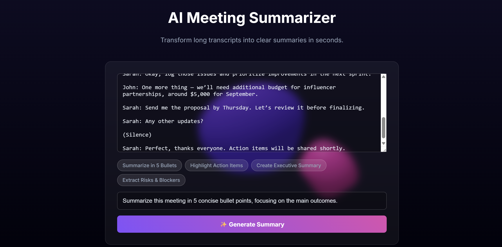
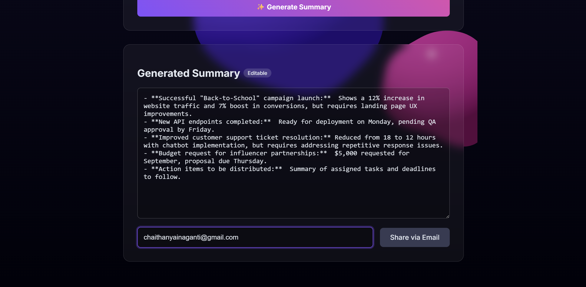
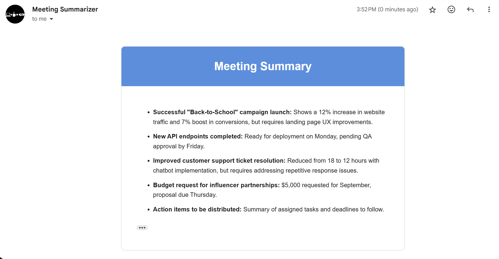

# 🤖 AI Meeting Notes Summarizer & Sharer

A full-stack MERN application that uses the Google Gemini API to summarize meeting transcripts based on custom user prompts and allows sharing the results via email.

[](https://nodejs.org/)
[](https://reactjs.org/)
[](https://mongodb.com/)
[](https://expressjs.com/)

## ✨ Features

- 📄 **Upload or paste long meeting transcripts**
- 🎯 **Provide custom instructions** (e.g., "summarize for executives," "list all action items")
- 🤖 **Generate structured summaries** using Google Gemini Pro model
- ✏️ **Edit generated summaries** directly in the browser
- 📧 **Share summaries via email** with anyone
- 🔒 **Secure API integration** with environment variable protection
- 📱 **Responsive design** for desktop and mobile

## 🛠️ Tech Stack

| Category | Technology |
|----------|------------|
| **Frontend** | Vite + React |
| **Backend** | Node.js + Express |
| **Database** | MongoDB (via Mongoose) |
| **AI Integration** | Google Gemini API (`@google/generative-ai`) |
| **Email Service** | Nodemailer |
| **Styling** | CSS3 / Tailwind CSS |

## 🚀 Quick Start

### Prerequisites

Before you begin, ensure you have the following installed:
- [Node.js](https://nodejs.org/) (v14 or higher)
- [MongoDB](https://mongodb.com/) (local or cloud instance)
- [Git](https://git-scm.com/)

### Installation

1. **Clone the repository:**
   ```bash
   git clone https://github.com/your-username/ai-summarizer-app.git
   cd ai-summarizer-app
   ```

2. **Install backend dependencies:**
   ```bash
   cd backend
   npm install
   ```

3. **Install frontend dependencies:**
   ```bash
   cd ../frontend
   npm install
   ```

## ⚙️ Environment Variables

You need to create `.env` files for both the frontend and backend.

### Backend (`/backend/.env`)
```env
PORT=5001
MONGO_URI="your_mongodb_connection_string"
GEMINI_API_KEY="your_google_gemini_api_key"
EMAIL_USER="your_email@gmail.com"
EMAIL_PASS="your_gmail_app_password"
NODE_ENV="development"
```

### Frontend (`/frontend/.env`)
```env
VITE_API_URL="http://localhost:5001/api"
```

## 🔧 Getting API Keys

### Google Gemini API Key
1. Visit [Google AI Studio](https://makersuite.google.com/app/apikey)
2. Create a new API key
3. Copy and paste it into your `.env` file

### Gmail App Password
1. Enable 2-Factor Authentication on your Gmail account
2. Go to Google Account Settings > Security > App passwords
3. Generate a new app password
4. Use this password in your `.env` file

## 🏃‍♂️ Running the Application

### Development Mode

1. **Start the backend server:**
   ```bash
   cd backend
   npm run dev
   ```

2. **Start the frontend development server:**
   ```bash
   cd frontend
   npm run dev
   ```

3. **Access the application:**
   - Frontend: `http://localhost:5173`
   - Backend API: `http://localhost:5001`

### Production Mode

1. **Build the frontend:**
   ```bash
   cd frontend
   npm run build
   ```

2. **Start the backend in production:**
   ```bash
   cd backend
   npm start
   ```

## 📸 Screenshots

### Dashboard
*Upload your meeting transcript and provide custom instructions*



### AI Summary Result
*View the generated summary with editing capabilities*



### Email Integration
*Share your summary via email*



## 📁 Project Structure

```
ai-summarizer-app/
├── backend/
│   ├── config/
│   │   └── database.js
│   ├── controllers/
│   │   ├── summaryController.js
│   │   └── emailController.js
│   ├── models/
│   │   └── Summary.js
│   ├── routes/
│   │   ├── summaryRoutes.js
│   │   └── emailRoutes.js
│   ├── middleware/
│   │   └── errorHandler.js
│   ├── .env
│   ├── server.js
│   └── package.json
├── frontend/
│   ├── src/
│   │   ├── components/
│   │   │   ├── Dashboard.jsx
│   │   │   ├── SummaryEditor.jsx
│   │   │   └── EmailShare.jsx
│   │   ├── services/
│   │   │   └── api.js
│   │   ├── App.jsx
│   │   └── main.jsx
│   ├── .env
│   ├── vite.config.js
│   └── package.json
├── screenshots/
├── README.md
└── .gitignore
```

## 🔗 API Endpoints

### Summary Routes
| Method | Endpoint | Description |
|--------|----------|-------------|
| POST | `/api/summary/generate` | Generate summary from transcript |
| PUT | `/api/summary/:id` | Update existing summary |
| GET | `/api/summary/:id` | Get summary by ID |

### Email Routes
| Method | Endpoint | Description |
|--------|----------|-------------|
| POST | `/api/email/send` | Send summary via email |

## 🤝 Contributing

1. Fork the project
2. Create your feature branch (`git checkout -b feature/AmazingFeature`)
3. Commit your changes (`git commit -m 'Add some AmazingFeature'`)
4. Push to the branch (`git push origin feature/AmazingFeature`)
5. Open a Pull Request

## 📝 Usage Examples

### Basic Summary Generation
```javascript
// Example API call to generate summary
const response = await fetch('/api/summary/generate', {
  method: 'POST',
  headers: { 'Content-Type': 'application/json' },
  body: JSON.stringify({
    transcript: "Your meeting transcript here...",
    instructions: "Summarize key points and action items"
  })
});
```

### Email Sharing
```javascript
// Example API call to send email
const response = await fetch('/api/email/send', {
  method: 'POST',
  headers: { 'Content-Type': 'application/json' },
  body: JSON.stringify({
    to: "recipient@example.com",
    subject: "Meeting Summary",
    summary: "Generated summary content..."
  })
});
```

## 🚨 Troubleshooting

### Common Issues

**Issue: Gemini API not responding**
- Verify your API key is correct
- Check if you have sufficient quota
- Ensure your IP is not blocked

**Issue: Email not sending**
- Verify Gmail app password is correct
- Check if 2FA is enabled on your Google account
- Ensure "Less secure app access" is disabled (use app passwords instead)

**Issue: MongoDB connection failed**
- Verify your MongoDB URI is correct
- Check if MongoDB service is running
- Ensure network access is allowed

## 📄 License

This project is licensed under the MIT License - see the [LICENSE](LICENSE) file for details.

## 🙏 Acknowledgments

- [Google Gemini API](https://ai.google.dev/) for AI-powered summarization
- [MongoDB](https://mongodb.com/) for database solutions
- [React](https://reactjs.org/) for the frontend framework
- [Express.js](https://expressjs.com/) for the backend framework
- [Nodemailer](https://nodemailer.com/) for email functionality

## 📞 Support

If you have any questions or need support, please open an issue on GitHub or contact:

- Email: your-email@example.com
- GitHub: [@your-username](https://github.com/your-username)

---

**Made with ❤️ by [Your Name]**

⭐ Star this repository if you found it helpful!